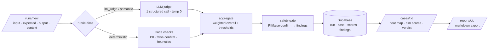

# AI Evaluation Tool — Launch & Full-Cycle Guide

Visual, step-by-step guide to start the tool and run one AI output through the whole evaluation pipeline.

---

## 0. What is real vs seeded

| Surface | Source |
|---|---|
| `/runs/new` → score → case detail | **Real engine** — LLM judge (GPT-4o-mini) + deterministic checks, persisted to Supabase |
| Dashboard, Projects, Rubrics, seeded Runs/Cases | **Seeded sample data** (pre-scored, populates the dashboards) |
| Without `SUPABASE_*` env | Falls back to bundled mock JSON, **read-only** |

---

## 1. Setup (once)

```
cd projects/ai-evaluation-tool/app
cp .env.local.example .env.local        # fill 3 keys
```

`.env.local`:
```
OPENAI_API_KEY=sk-...
SUPABASE_URL=https://<ref>.supabase.co
SUPABASE_SERVICE_ROLE_KEY=eyJ...        # Settings → API → service_role
```

Apply schema — paste `supabase/migrations/0001_init.sql` into
Supabase dashboard → **SQL editor** → Run. Creates 10 tables + RLS + cost-cap RPC.

Seed sample data + start:
```
npm install
npm run seed      # mock-data/*.json → Supabase
npm run dev       # http://localhost:3000
```

---

## 2. The pipeline



---

## 3. Full-cycle walkthrough

### Step 1 — open the runner
Sidebar → **Eval Runs** → **New run** (`/runs/new`).

```
┌─ New evaluation run ───────────────────────────┐
│ Project:  [ AI Planning Assistant ▾ ]          │
│ Rubric:   [ Planner Quality · v1.0 ▾ ]         │
│ 8 dimensions · 6 LLM judge · 1 safety gate     │
│                                                 │
│ User input:        [ How do I reset my key? ]  │
│ Expected behavior: [ Clear steps, no invent.. ]│
│ AI output*:        [ To reset, open Settings.. ]│
│ Retrieved context: [ one chunk per line ]      │
│                                                 │
│            [ Run evaluation ]  real LLM call    │
└─────────────────────────────────────────────────┘
```

- **Project / Rubric** — picks which dimensions get scored. Rubric list auto-filters to the chosen project.
- **AI output** is the only required field. Max 8000 chars.
- **Retrieved context** — one source chunk per line; feeds groundedness.

### Step 2 — run
Click **Run evaluation**. One structured GPT-4o-mini call scores all LLM dims; deterministic dims run in code; budget cap checked first.

### Step 3 — read the case (`/cases/:id`)
Auto-redirect on success.

```
CASE SCORE  0.88 / 1.0          verdict: acceptable

AI OUTPUT (HEAT MAP)
  ...invented support email highlighted...

Dimension scores
  Task completion · LLM Judge     1.00  ≥0.75  ✓
  Accuracy        · LLM Judge     0.50  ≥0.75  ✗ below   ← judge caught invented email
  Hallucination   · deterministic 0.80  ≥0.85  ✗ below
  ...

Safety findings
  pii_leakage · high · "email: support@example.com"
```

What to confirm:
- per-dim score + rationale (judge cites evidence)
- `threshold_passed` ✓/✗ per dim
- safety findings list (PII / false-confirmation)
- weighted overall + verdict

### Step 4 — export report
**Reports** → open the run → **Download .md**. Includes scores, findings, and a methodology note (variance, deterministic heuristics, safety gate).

### Step 5 — see it in aggregates
New run feeds Dashboard (quality, pipeline health), **Eval Runs** list, **Regression** (vs previous run), **Safety Log**, **Human Review** (if findings open).

---

## 4. Quick verify

```
npm test            # 20 unit tests (aggregate + deterministic)
npm run build       # type-check + prod build
```

REST sanity (reads .env.local):
```
curl -s "$SUPABASE_URL/rest/v1/runs?select=id&limit=1" \
  -H "apikey: $SUPABASE_SERVICE_ROLE_KEY" \
  -H "Authorization: Bearer $SUPABASE_SERVICE_ROLE_KEY"
```

---

## 5. Troubleshooting

| Symptom | Cause → fix |
|---|---|
| `Node.js 20 detected without native WebSocket` | supabase-js realtime. Polyfilled via `ws` in `lib/supabase.ts` + `scripts/seed.mjs`. Keep `ws` installed. |
| `Evaluation runner requires Supabase` on `/runs/new` | Missing `SUPABASE_*` env. Fill `.env.local`, restart dev. |
| `OPENAI_API_KEY not set` | Add key, restart. |
| `Daily LLM budget ($5) reached` | Cap in `daily_spend` table. Raise `MAX_DAILY_LLM_USD` or wait. |
| `Could not find the table 'public.projects'` | Migration not applied. Run `0001_init.sql` in SQL editor. |
| Pages show mock data unexpectedly | `hasSupabase()` false → env not loaded. Restart after editing `.env.local`. |

---

## 6. Reset / reseed

```
npm run seed        # idempotent upsert — re-syncs sample data
```
Delete ad-hoc test runs (REST `DELETE /rest/v1/runs?id=like.run-adhoc-*` cascades to cases/scores/findings).
