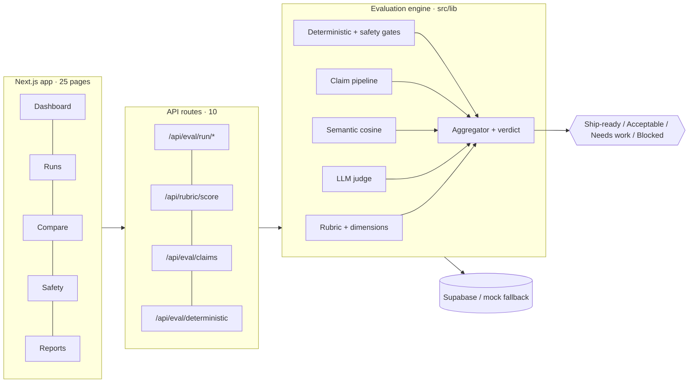
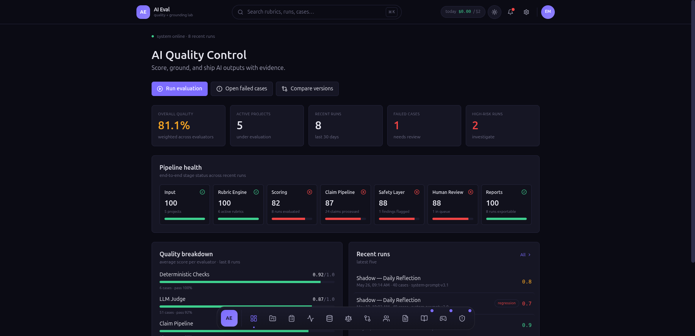
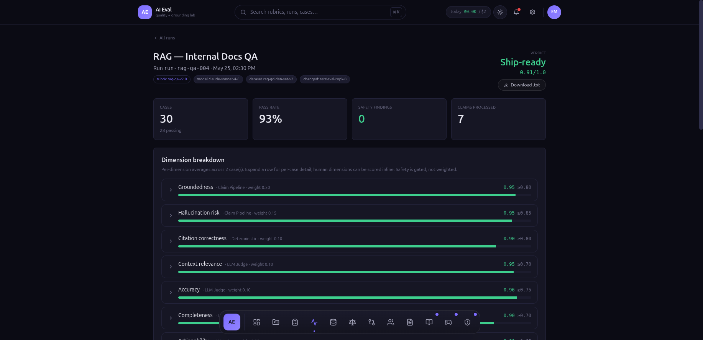
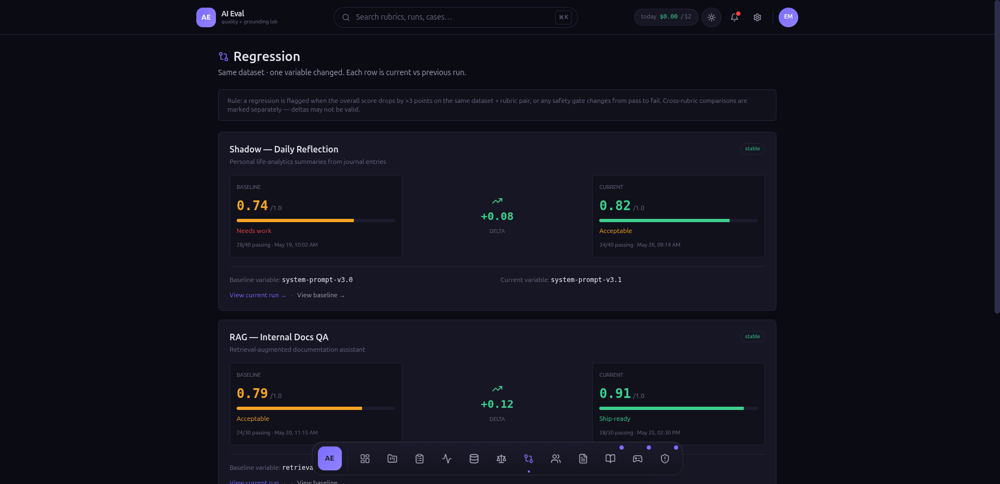
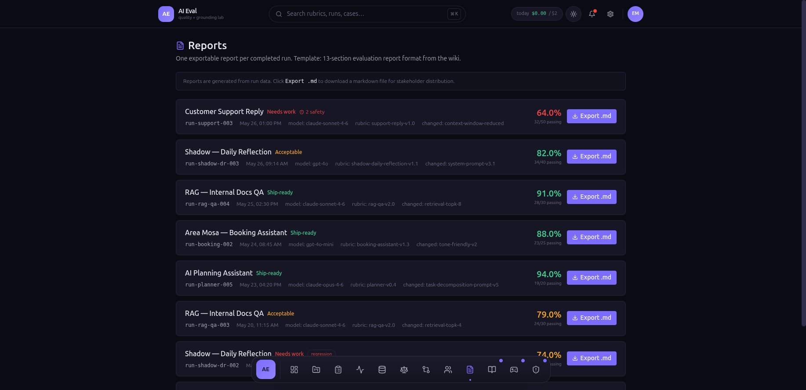

# AI Evaluation Tool

**Evidence-backed quality control for LLM outputs.**

AI products should not ship because an answer "looks good".
This tool scores AI outputs against rubrics, checks claims against evidence, catches safety failures, and produces launch-ready evaluation reports.

> Evaluate AI with evidence, not vibes.

<p align="center">
  <a href="https://github.com/Qalipso/ai-evaluation-tool/actions/workflows/ci.yml"></a>
  
  
  
  
</p>

<p align="center">
  <a href="https://ai-eval-tool.vercel.app/">
    
  </a>
</p>

<p align="center">
  <a href="https://ai-eval-tool.vercel.app/">Live demo</a>
  ·
  <a href="./docs/DEMO.md">90-second demo path</a>
  ·
  <a href="https://github.com/Qalipso/ai-evaluation-tool">GitHub</a>
</p>

---

## Proof

A working evaluation engine, not a mockup. Every claim here is backed by code or tests.

- **135 unit tests, all passing** — `npm test`. Engine logic only: scoring, aggregation, verdict gates, claim grounding, deterministic safety checks, PII + language detection. See [`app/tests/unit`](./app/tests/unit).
- **CI on every push** — GitHub Actions runs lint + typecheck + test + build. See [`.github/workflows/ci.yml`](./.github/workflows/ci.yml). The badge above reflects the live result.
- **17 runnable eval scenarios** across hallucination / safety / format, each asserted against the real engine in CI. See [`app/src/lib/eval-scenarios`](./app/src/lib/eval-scenarios).
- **Real vs mock, stated plainly** — with no env the app serves bundled mock data (read-only, no persistence). Real scoring (LLM judge, embeddings, claim pipeline, deterministic gates) runs only with `OPENAI_API_KEY` + Supabase. A dimension with no real scorer is reported `unscored`, never a placeholder number.

---

## Architecture



One case fans out across the scoring, claim, and safety paths; results converge in the aggregator, where the verdict gate decides ship vs block. Storage is downstream — the run is written once, reports and the review queue read from it. Detailed pipeline diagrams live in [`diagrams/`](./diagrams).

---

## Product preview

A walkthrough of the dark evaluation cockpit — rubric scoring, claim grounding,
safety gates, and the ship/block verdict — lives on the portfolio project page:

- **Project page:** [shatalov.dev](https://shatalov.dev)
- **Live app:** [ai-eval-tool.vercel.app](https://ai-eval-tool.vercel.app/)

The rest of this README stays focused on proof, architecture, and setup.

---

## Screenshots

| Dashboard | Run detail |
|---|---|
| [](./docs/assets/screenshots/dashboard.png) | [](./docs/assets/screenshots/run-detail.png) |
| Quality health, pipeline status, evaluator breakdown | Ship-ready verdict + per-dimension scores with methods/thresholds |

| Regression | Reports |
|---|---|
| [](./docs/assets/screenshots/regression.png) | [](./docs/assets/screenshots/reports.png) |
| Baseline vs current deltas + verdicts | Exportable evaluation reports per run |

Live, seeded demo: [ai-eval-tool.vercel.app](https://ai-eval-tool.vercel.app/) · 90-second path: [docs/DEMO.md](./docs/DEMO.md)

---

## Why this exists

LLM outputs are fluent by default.
That does not make them correct, grounded, safe, or production-ready.

A single confident answer can hide:

- hallucinated facts
- unsupported claims
- false confirmations
- broken business rules
- policy violations
- regressions after a prompt/model change

Most teams review AI output by feel.
This project turns that into a repeatable evaluation system.

---

## Product formula

```txt
AI Output → Rubric → Claim Pipeline → Safety Gates → Verdict → Report
```

AI Evaluation Tool helps answer one question:

> Is this AI output good enough to ship?

---

## Product flow

The evaluation loop follows four stages:

| Stage | Purpose |
|---|---|
| Rubrics | Define what quality means |
| Claim Pipeline | Check factual claims against evidence |
| Safety Gates | Block non-negotiable risks |
| Verdict | Decide whether the output can ship |

### Rubric breakdown

<p align="center">
  
</p>

Rubrics define dimensions, weights, thresholds, and scoring methods. The engine ships **14 reference dimensions** (`app/src/lib/eval/dimensions.ts`): accuracy, relevance, completeness, task_completion, hallucination_risk, groundedness, safety, consistency, tone_fit, actionability — plus extended ones for conversational/reflective products: helpfulness, emotional_nuance, non_judgmental_tone, useful_next_step.

### Claim pipeline

<p align="center">
  
</p>

The system extracts claims from the AI output and checks them against retrieved evidence.

### Safety gates

<p align="center">
  
</p>

Some failures should block a run instead of being averaged into a score.

### Verdict score

<p align="center">
  
</p>

Every run ends with a verdict: **Ship-ready**, **Acceptable**, **Needs work**, or **Blocked**.

Thresholds (see `app/src/lib/eval/aggregate.ts`):

| Verdict | Rule |
|---|---|
| **Ship-ready** | overall ≥ 0.85 and no dimension below its threshold |
| **Acceptable** | overall ≥ 0.70 |
| **Needs work** | overall < 0.70 |
| **Blocked** | any safety gate fails, regardless of score |

---

## 90-second demo path

1. Open **Dashboard** — see quality health across projects.
2. Open the **RAG — Internal Docs QA** run (`/runs/run-rag-qa-004`) — inspect the claim heat map, grounded vs unsupported claims, and the Ship-ready verdict.
3. Open **Safety Log** (`/safety`) — inspect the open finding that blocks a run.
4. Open **Regression** (`/compare`) — compare prompt/model changes with score deltas.
5. Open **Reports** — export a stakeholder-ready markdown summary.
6. Open **Play** (`/play`, "Outputs, Please") — practice claim labeling.

---

## What it does

- **Rubric scoring** — evaluate AI outputs across weighted dimensions
- **LLM-as-judge** — score subjective quality dimensions with rationale (GPT-4o-mini)
- **Claim pipeline** — extract factual claims and verify each against retrieved evidence
- **Semantic similarity** — embedding cosine vs the expected behavior
- **Deterministic checks** — pattern-based checks: PII, false confirmation, language match, length
- **Safety gates** — block critical issues regardless of average score
- **Human review** — inspect failed cases, override scores, calibrate judgment
- **Datasets** — versioned test sets for apples-to-apples regression across model/prompt changes
- **Regression compare** — diff two runs and flag score drops
- **Reports** — export run summaries (`.md` / `.txt`) with scores, rationales, failures, and evidence

Five scoring methods are configurable per rubric dimension: `llm_judge`, `semantic_similarity`, `claim_pipeline`, `deterministic`, `human`. A dimension with no real scorer is reported as `unscored` — never coerced to a placeholder number.

---

## Example use case

A WhatsApp booking assistant replies:

```txt
"Your appointment is confirmed for 18:00."
```

But the calendar evidence says:

```txt
No available slot found at 18:00.
```

The evaluation catches:

```txt
False confirmation
Unsupported claim
Safety gate failure
Verdict: blocked
```

After the assistant is fixed, it checks availability before confirming.

```txt
Verdict: ship-ready
Score: 0.94 / 1.0
```

---

## How it works

```txt
Input
  ↓
Rubric Engine
  ↓
LLM Judge
  ↓
Claim Extraction
  ↓
Evidence Matching
  ↓
Deterministic Safety Checks
  ↓
Human Review
  ↓
Report Generator
```

### Input

A test case can include:

- user input
- expected behavior
- AI output
- retrieved context
- metadata

### Rubric engine

Defines dimensions, weights, thresholds, and scoring methods.

### Claim pipeline

Extracts factual claims and labels them as:

- `supported`
- `partially_supported`
- `unsupported`
- `contradicted`

### Safety layer

Runs deterministic checks for high-risk failures. Implemented checks:

| Check | Severity | Blocks release |
|---|---|---|
| `pii_leakage` | critical | yes |
| `false_confirmation` | critical | yes |
| `booking_requires_calendar_write` | critical | yes |
| `language_match` | critical | yes |
| `manager_request_requires_handoff` | error | no |
| `output_length_limit` | warning | no |

### Verdict

Aggregates scores, thresholds, claim results, and safety findings into a launch decision.

---

## Why not just use an LLM judge?

An LLM judge can help, but it is not enough.

This tool combines:

| Layer | Purpose |
|---|---|
| LLM judge | Subjective quality |
| Claim checking | Factual grounding |
| Deterministic checks | Known failure patterns |
| Safety gates | Non-negotiable blockers |
| Human review | Calibration and edge cases |
| Reports | Repeatability and accountability |

The goal is not just to produce a score.

The goal is to explain:

- what passed
- what failed
- why it failed
- whether it is safe to ship
- what should be fixed next

---

## App surfaces

### Primary views

| Route | Purpose |
|---|---|
| `/` | Quality dashboard across projects |
| `/projects` · `/projects/[id]` · `/projects/new` | Project CRUD |
| `/rubrics` · `/rubrics/[id]` · `/rubrics/new` | Rubric builder |
| `/runs` · `/runs/new` · `/runs/[id]` | Run list, batch runner, run detail |
| `/cases/[id]` | Case detail: scores, claim heat map, findings |
| `/compare` | Regression comparison between two runs |
| `/datasets` · `/datasets/[id]` | Versioned test sets |
| `/evaluators` | Configure scoring engines + global settings |
| `/play` | Manual case inspection / practice mode |
| `/review` · `/review/[id]` | Human review queue + per-case scoring |
| `/reports` · `/reports/[id]` | Exportable evaluation reports |
| `/safety` | Safety findings and policy violations |
| `/wiki` · `/wiki/[slug]` · `/wiki/start-here` | Evaluation knowledge base |
| `/enter` | Demo access gate (when `DEMO_ACCESS_CODE` set) |

### API routes

`POST /api/eval/run/start` · `POST /api/eval/run/case` · `POST /api/eval/run/finalize` · `POST /api/eval/questions` · `POST /api/eval/answer` · `POST /api/eval/claims` · `POST /api/eval/deterministic` · `POST /api/rubric/score` · `GET /api/index` · `POST /api/enter`

25 pages + 10 API routes total.

---

## Tech stack

- Next.js 15 · React 19
- TypeScript 5
- Tailwind CSS 3
- Supabase (PostgreSQL) `@supabase/supabase-js` 2
- OpenAI SDK 6
- Zod 4
- Vitest 2

---

## Quick start

```bash
git clone https://github.com/Qalipso/ai-evaluation-tool.git
cd ai-evaluation-tool/app
npm install
cp .env.local.example .env.local   # fill OPENAI_API_KEY + SUPABASE_*
npm run dev
```

Open `http://localhost:3000`.

With no env, the app runs on bundled mock data (read-only, no persistence). For full live evaluation, fill the env below, apply the migrations, then seed:

```bash
# in the Supabase SQL editor, run in order:
#   supabase/migrations/0001_init.sql
#   supabase/migrations/0002_eval_settings.sql
#   supabase/migrations/0003_datasets.sql
npm run seed
npm run dev
```

See [docs/DEMO.md](./docs/DEMO.md) for what works in the public demo vs what requires env.

---

## Environment variables

```bash
# required for live evaluation
OPENAI_API_KEY=
SUPABASE_URL=
SUPABASE_SERVICE_ROLE_KEY=

# optional — public deploy hardening
DEMO_ACCESS_CODE=          # enables the /enter auth gate
DEMO_SESSION_SECRET=       # signs demo sessions
MAX_DAILY_LLM_USD=2        # daily spend cap (default 2)

# optional — model overrides (sensible defaults if unset)
OPENAI_JUDGE_MODEL=gpt-4o-mini
OPENAI_CLAIM_MODEL=gpt-4o-mini
OPENAI_GEN_MODEL=gpt-4o-mini
OPENAI_EMBED_MODEL=text-embedding-3-small
```

---

## Project structure

```txt
app/
  src/
    app/                  Next.js routes (pages + /api)
    components/           UI components
    lib/
      eval/               Evaluation engine (judges, claims, semantic, aggregate, run, budget)
      evaluators/         Deterministic checks, safety gates, PII + language detection
      eval-scenarios/     Runnable scenario library (hallucination / safety / format)
      validation/         Zod schemas
      wiki/               Knowledge base utilities
  tests/unit/             Vitest unit tests (135) — engine, detectors, scenarios
  scripts/seed.mjs        Seed script
supabase/migrations/      0001_init · 0002_eval_settings · 0003_datasets
mock-data/                Bundled read-only fallback data
docs/assets/              Motion assets (teaser + chart GIFs)
wiki/                     Evaluation knowledge base (markdown)
```

---

## Development

```bash
npm run dev
npm run test
npm run lint
npm run build
```

---

## Security notes

Before deploying publicly:

- keep `SUPABASE_SERVICE_ROLE_KEY` server-side only
- do not expose raw private evaluation data in public reports
- review Supabase RLS policies
- redact sensitive user input/output where needed
- separate demo data from real production data
- avoid logging secrets, API keys, or private customer content

---

## Roadmap

- [ ] Golden dataset support
- [ ] Judge calibration dashboard
- [ ] Prompt/model regression tracking
- [ ] Run comparison improvements
- [x] CI integration for AI output tests
- [x] More deterministic safety gates
- [ ] Public demo dataset
- [ ] Video report generation from evaluation runs
- [x] Better test coverage for scoring and reports

---

## Portfolio context

Built by **Eduard Shatalov** as part of an AI product engineering portfolio.

The project demonstrates:

- AI product thinking
- LLM evaluation architecture
- rubric-based scoring
- claim grounding
- safety gates
- full-stack product development
- technical documentation
- product storytelling
