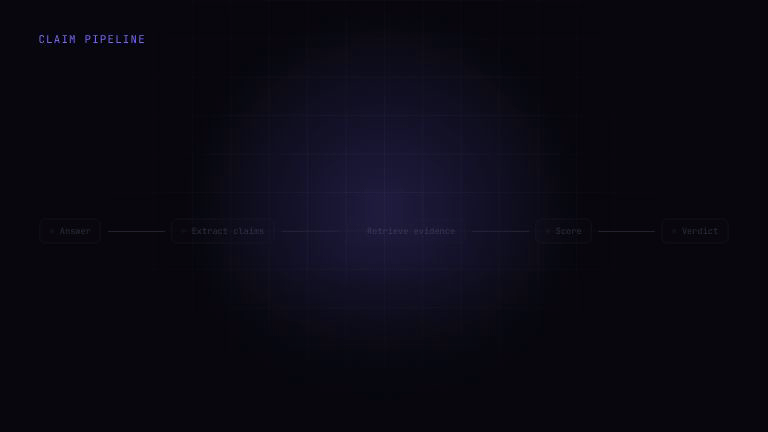
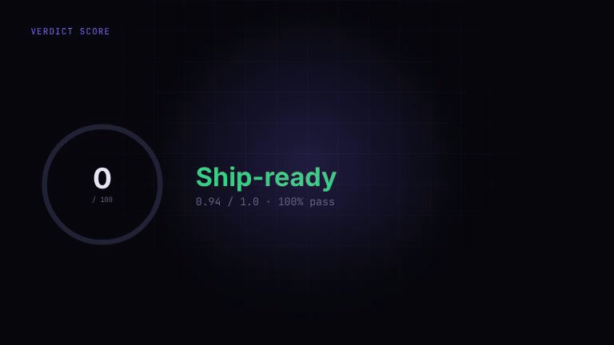

# AI Evaluation Tool

**Evidence-backed quality control for LLM outputs.**

AI products should not ship because an answer "looks good".
This tool scores AI outputs against rubrics, checks claims against evidence, catches safety failures, and produces launch-ready evaluation reports.

> Evaluate AI with evidence, not vibes.

<p align="center">
  <a href="https://edu.dev/projects/ai-evaluation-tool">
    
  </a>
</p>

<p align="center">
  <a href="https://edu.dev/projects/ai-evaluation-tool">Watch product preview</a>
  ·
  <a href="https://github.com/Qalipso/ai-evaluation-tool">GitHub</a>
</p>

---

## Why this exists

LLM outputs are fluent by default.
That does not make them correct, grounded, safe, or production-ready.

A single confident answer can hide:

- hallucinated facts
- unsupported claims
- false confirmations
- broken business rules
- policy violations
- regressions after a prompt/model change

Most teams review AI output by feel.
This project turns that into a repeatable evaluation system.

---

## Product formula

```txt
AI Output → Rubric → Claim Pipeline → Safety Gates → Verdict → Report
```

AI Evaluation Tool helps answer one question:

> Is this AI output good enough to ship?

---

## Product flow

The evaluation loop follows four stages:

| Stage | Purpose |
|---|---|
| Rubrics | Define what quality means |
| Claim Pipeline | Check factual claims against evidence |
| Safety Gates | Block non-negotiable risks |
| Verdict | Decide whether the output can ship |

### Rubric breakdown

<p align="center">
  
</p>

Rubrics define dimensions, weights, thresholds, and scoring methods.

### Claim pipeline

<p align="center">
  
</p>

The system extracts claims from the AI output and checks them against retrieved evidence.

### Safety gates

<p align="center">
  
</p>

Some failures should block a run instead of being averaged into a score.

### Verdict score

<p align="center">
  
</p>

Every run ends with a verdict: `ship-ready`, `acceptable`, `needs-work`, or `blocked`.

---

## What it does

- **Rubric scoring** — evaluate AI outputs across weighted dimensions
- **LLM-as-judge** — score subjective quality dimensions with rationale
- **Claim grounding** — extract factual claims and compare them with evidence
- **Deterministic checks** — catch pattern-based failures like PII or false confirmation
- **Safety gates** — block critical issues regardless of average score
- **Human review** — inspect failed cases and calibrate judgment
- **Reports** — export run summaries with scores, rationales, failures, and evidence

---

## Example use case

A WhatsApp booking assistant replies:

```txt
"Your appointment is confirmed for 18:00."
```

But the calendar evidence says:

```txt
No available slot found at 18:00.
```

The evaluation catches:

```txt
False confirmation
Unsupported claim
Safety gate failure
Verdict: blocked
```

After the assistant is fixed, it checks availability before confirming.

```txt
Verdict: ship-ready
Score: 0.94 / 1.0
```

---

## How it works

```txt
Input
  ↓
Rubric Engine
  ↓
LLM Judge
  ↓
Claim Extraction
  ↓
Evidence Matching
  ↓
Deterministic Safety Checks
  ↓
Human Review
  ↓
Report Generator
```

### Input

A test case can include:

- user input
- expected behavior
- AI output
- retrieved context
- metadata

### Rubric engine

Defines dimensions, weights, thresholds, and scoring methods.

### Claim pipeline

Extracts factual claims and labels them as:

- `supported`
- `partial`
- `unsupported`
- `contradicted`

### Safety layer

Runs deterministic checks for high-risk failures.

### Verdict

Aggregates scores, thresholds, claim results, and safety findings into a launch decision.

---

## Why not just use an LLM judge?

An LLM judge can help, but it is not enough.

This tool combines:

| Layer | Purpose |
|---|---|
| LLM judge | Subjective quality |
| Claim checking | Factual grounding |
| Deterministic checks | Known failure patterns |
| Safety gates | Non-negotiable blockers |
| Human review | Calibration and edge cases |
| Reports | Repeatability and accountability |

The goal is not just to produce a score.

The goal is to explain:

- what passed
- what failed
- why it failed
- whether it is safe to ship
- what should be fixed next

---

## App surfaces

| Route | Purpose |
|---|---|
| `/` | Quality dashboard |
| `/evaluators` | Configure scoring engines and checks |
| `/runs/new` | Start a new evaluation run |
| `/runs/[id]` | Inspect run results |
| `/play` | Manual inspection / practice mode |
| `/review` | Human review queue |
| `/reports` | Exportable evaluation reports |
| `/safety` | Safety layer |
| `/wiki` | Evaluation knowledge base |

---

## Tech stack

- Next.js 15
- React 19
- TypeScript
- Tailwind CSS
- Supabase
- OpenAI SDK
- Zod
- Vitest

---

## Quick start

```bash
git clone https://github.com/Qalipso/ai-evaluation-tool.git
cd ai-evaluation-tool/app
npm install
npm run dev
```

Open:

```txt
http://localhost:3000
```

The app can run with demo/fallback data, but full live evaluation requires OpenAI and Supabase credentials.

---

## Environment variables

```bash
OPENAI_API_KEY=
NEXT_PUBLIC_SUPABASE_URL=
NEXT_PUBLIC_SUPABASE_ANON_KEY=
SUPABASE_SERVICE_ROLE_KEY=
```

---

## Project structure

```txt
app/
  src/
    app/                  Next.js routes
    components/           UI components
    lib/
      eval/               Evaluation engine
      evaluators/         Evaluator definitions
      llm/                LLM judge integration
      validation/         Zod schemas
      wiki/               Knowledge base utilities
    tests/                Unit tests
docs/
  media/                  GIFs, screenshots, preview assets
```

---

## Development

```bash
npm run dev
npm run test
npm run lint
npm run build
```

---

## Security notes

Before deploying publicly:

- keep `SUPABASE_SERVICE_ROLE_KEY` server-side only
- do not expose raw private evaluation data in public reports
- review Supabase RLS policies
- redact sensitive user input/output where needed
- separate demo data from real production data
- avoid logging secrets, API keys, or private customer content

---

## Roadmap

- [ ] Golden dataset support
- [ ] Judge calibration dashboard
- [ ] Prompt/model regression tracking
- [ ] Run comparison improvements
- [ ] CI integration for AI output tests
- [ ] More deterministic safety gates
- [ ] Public demo dataset
- [ ] Video report generation from evaluation runs
- [ ] Better test coverage for scoring and reports

---

## Portfolio context

Built by **Eduard Shatalov** as part of an AI automation / AI product engineering portfolio.

The project demonstrates:

- AI product thinking
- LLM evaluation architecture
- rubric-based scoring
- claim grounding
- safety gates
- full-stack product development
- technical documentation
- product storytelling
