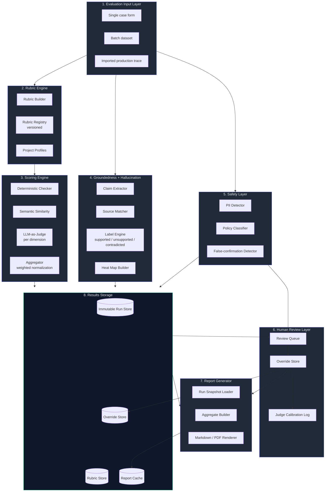

# Architecture — AI Evaluation Tool

This document describes the system layers, the data flow, the boundaries, and the design choices that shape the tool.

The architecture is layered, not monolithic. Each layer has a single responsibility, a defined input, a defined output, and may be replaced independently.

---

## 1. System diagram



The diagram shows the eight layers and the direction of data. Storage is a sink for most layers and a source for the Report Generator and the Review Queue. Human overrides loop back into reports but never into the original run snapshot.

---

## 2. Layers in detail

### 2.1 Evaluation Input Layer

**Responsibility:** Receive evaluation cases from any source and normalize them.

**Inputs:**
- A single case via UI form.
- A batch dataset (JSON / CSV).
- (V2) A production trace imported from an observability backend.

**Output:** A normalized `EvaluationCase` object:
```
{
  case_id, input, expected_behavior, ai_output,
  retrieved_context[], metadata { model, prompt_id, version, dataset, tags }
}
```

**Validation:**
- Required fields are present.
- Output is text (MVP).
- `retrieved_context`, if present, is an array of strings.
- Metadata fields are typed.

**Why this layer exists:** Downstream layers should not know where a case came from. The form, the dataset import, and the future trace import all converge here.

### 2.2 Rubric Engine

**Responsibility:** Define, version, and serve rubrics.

**Components:**
- **Rubric Builder.** UI for adding dimensions, choosing scoring methods, setting weights and thresholds. Validates weight normalization at save time.
- **Rubric Registry.** Stores rubric versions. A rubric in active use is immutable; new versions are created by branching.
- **Project Profiles.** Preloaded rubric bundles per product shape (RAG, classification, agent, conversational, generative). A profile is a curated starting rubric, not a final one.

**Outputs:** A versioned `Rubric` object referenced by every evaluation run.

**Why this layer exists:** The rubric is not configuration; it is a product artifact. Stripping it out of the scoring engine into its own layer makes "the rubric was wrong" debuggable as a first-class hypothesis.

### 2.3 Scoring Engine

**Responsibility:** Produce per-dimension scores for a case against a rubric.

**Components:**
- **Deterministic Checker.** Runs rule-based checks (regex, contains, length, JSON shape, required keywords). Cheap, fast, fully reproducible.
- **Semantic Similarity.** Embedding-based comparison against a reference output. Used for dimensions like "matches expected behavior at a paraphrase level".
- **LLM-as-Judge.** Per-dimension LLM call with a structured prompt. Returns score + rationale. Uses retries, parses JSON, falls back to `unscored` on persistent failure.
- **Aggregator.** Normalizes weights, computes per-case overall, computes batch aggregates (mean, median, p25, p75, distribution).

**Output:** A scored case with `{ dimension_id, score, rationale, evidence, method, threshold_passed }` per dimension.

**Why split:** Each method has different cost, latency, and trust profile. The scoring engine routes each dimension to the right method. A team can move a dimension between methods (e.g. "completeness was LLM-judge, now we have a deterministic checklist") without changing the rest of the system.

### 2.4 Groundedness + Hallucination Layer

**Responsibility:** Operate at the claim level, not the dimension level.

**Components:**
- **Claim Extractor.** LLM-judge prompt tuned to atomic claim extraction (not scoring). Robust to code blocks and quoted text.
- **Source Matcher.** For each claim, searches `retrieved_context` for semantic support or contradiction.
- **Label Engine.** Assigns `supported` / `partially_supported` / `unsupported` / `contradicted`, with confidence.
- **Heat Map Builder.** Builds a token-level annotation over `ai_output` for the UI overlay.

**Shared invariant:** Both the hallucination dimension score and the groundedness dimension score use the same extracted claim set. Inconsistency between them is a bug, not a feature.

**Output:** A `ClaimReport` with claim list, labels, evidence, and the heat map data structure.

**Why a dedicated layer:** Span-level evidence is the only honest way to score these dimensions. Treating them as one more "rate this 0–10" question would hide the most important information.

### 2.5 Safety Layer

**Responsibility:** Detect findings that cannot be scored away by other dimensions.

**Components:**
- **PII Detector.** Regex + entity recognition for emails, phones, IDs, addresses, card-number-like patterns.
- **Policy Classifier.** LLM-judge prompts for harmful instruction following, harassment, self-harm content, false action confirmation, regulated advice without disclaimer.
- **False-confirmation Detector.** Specific check for outputs that claim an action ("booked", "sent", "deleted") with no backing tool call in the metadata.

**Output:** A `SafetyReport` with category, severity, evidence span. Sets `safety_review_required: true` when severity ≥ medium.

**Why isolated:** Safety findings are not a dimension. They are a top-level signal that gates the case's `resolved` status. Mixing them into the rubric would let a team weight them down to zero, which is exactly what must not be possible.

### 2.6 Human Review Layer

**Responsibility:** Allow humans to override and to audit the LLM judge.

**Components:**
- **Review Queue.** Priority list of cases needing review. Priority order: open safety findings, then high uncertainty (LLM judge confidence below threshold), then random sampling.
- **Override Store.** Records per-dimension human scores with required reason strings. Never overwrites the original judge score.
- **Judge Calibration Log.** Aggregates human-vs-judge deltas over time per dimension and per project. Surfaces systematic judge bias.

**Output:** Override records and a calibration view.

**Why a dedicated layer:** Without this layer, an LLM judge becomes ground truth by default. With this layer, the judge is a fast first-pass and humans remain the source of truth for safety and high-stakes dimensions.

### 2.7 Report Generator

**Responsibility:** Render a deterministic, shareable artifact from a stored run.

**Components:**
- **Run Snapshot Loader.** Loads an immutable run from storage.
- **Aggregate Builder.** Computes summary numbers, distributions, top-failing-cases selection.
- **Renderer.** Renders the markdown template; optionally renders markdown to PDF.

**Output:** Markdown + optional PDF. Stored in the report cache for re-download.

**Why separate from scoring:** The report is the *external face* of the tool. Engineers see scores; everyone else sees the report. Keeping it isolated lets the template evolve without touching the scoring logic.

### 2.8 Results Storage

**Responsibility:** Persist runs, rubrics, overrides, and reports.

**Stores:**
- **Run Store.** Append-only. Immutable. One row per evaluation run.
- **Rubric Store.** Versioned rubrics; active version pointer per project.
- **Override Store.** One row per dimension override.
- **Report Cache.** Pre-rendered report markdown keyed by `(run_id, override_set_hash)`.

**MVP implementation:** JSON files on disk, schema-validated on read.
**V1:** SQLite or Postgres for query performance.
**V2:** Object storage for run snapshots, relational store for indexing.

**Why immutable runs:** Audit value is the entire reason this tool exists. A mutable run store cannot answer "what did we know at launch time".

---

## 3. Data flow

A single evaluation case flows as follows:

1. **Input layer** normalizes the case.
2. **Rubric engine** supplies the active rubric.
3. **Safety layer** runs in parallel with scoring. A `medium+` finding does not abort scoring; it sets the review flag.
4. **Scoring engine** evaluates each dimension by its method.
5. **Hallucination + Groundedness layer** runs the claim pipeline once and feeds both dimensions.
6. **Aggregator** computes overall score using rubric weights, gated by safety and thresholds.
7. **Storage** writes the run immutably.
8. **Review queue** is populated if review is required.
9. **Report generator** is invoked on demand from storage.

A batch run is the same flow per case, with a wrapping batch record holding aggregates and metadata.

---

## 4. Boundaries

The tool has hard product boundaries that are also architectural boundaries.

| In | Out |
|---|---|
| Score outputs that were already generated | Generate outputs |
| Rubric definition and versioning | Prompt definition and versioning (PromptOps) |
| Offline / on-demand evaluation runs | Online production observability |
| Markdown / PDF report export | Live dashboard with auto-refresh (V2) |
| Human override and calibration | Auto-fine-tuning from overrides |

When in doubt, the rule is: **the unit of analysis is an AI output**. If the work to do is about generating, modifying, deploying, or monitoring the AI, it belongs in a different tool.

---

## 5. External dependencies

| Dependency | Why | Fallback |
|---|---|---|
| LLM provider (judge model) | LLM-as-judge dimensions, claim extraction, safety classifier | Deterministic-only mode is supported; rubrics that depend on judges report `unscored` |
| Embedding provider | Semantic similarity, claim-to-source matching | Hash-based fallback for semantic similarity (degraded quality) |
| PII regex library | Safety detection | Bundled rules; library swap is local |
| Markdown / PDF renderer | Reports | Markdown-only export is always available |

The system is built so that the **judge model is replaceable**. Any model exposed through a standard chat-completion interface can serve as a judge. The judge prompt set is the same; the model choice is configurable per project.

---

## 6. Performance and cost model

- A single case costs roughly: 1 claim-extraction call + N judge calls (one per `llm_judge` dimension) + 1 safety classifier call. Deterministic and similarity checks are free in compute terms.
- A 100-case batch with a 6-dimension rubric (3 LLM-judge) is ~700 model calls.
- The judge model is cost-sensitive. The default judge is a small/fast model; high-stakes dimensions can override to a larger model per rubric.
- Embedding calls are cached by content hash. Re-evaluating the same output skips the embedding step.

The architecture treats the judge model as the dominant cost and the bottleneck. Most optimization energy goes here: prompt caching, parallelism within a case, batching across cases.

---

## 7. Failure modes and how the architecture handles them

| Failure | Layer | Behavior |
|---|---|---|
| Judge model timeout | Scoring | Dimension marked `unscored`; case still saved |
| Judge returns malformed JSON | Scoring | One retry with stricter format prompt; then `unscored` |
| Source matcher finds no support | Hallucination | Claim labeled `unsupported`; case enters review queue |
| PII detected | Safety | `safety_review_required: true`; case can still be scored but cannot be `resolved` |
| Storage write fails | Storage | Run held in retry buffer; user-visible error |
| Rubric weights unnormalized | Rubric Engine | Save blocked at validation |
| Mismatched runs in comparison | Report | Comparison blocked; the two runs are listed for clarity |
| Concurrent overrides | Human Review | Last-write-wins with prior-override audit |

The recurring pattern: **explicit failures over silent partials**. `unscored` is a first-class value. The system never coerces missing data to `0`.

---

## 8. Why this shape, and not a single LLM call

A simpler design would be: "feed the case to a strong LLM, ask for an overall score and a rationale, done."

This design rejects that because:

- **Calibration.** A single judge cannot be audited. With a layered design, the team can see *which* dimensions drift, swap judges per dimension, and calibrate against human review.
- **Safety isolation.** Safety must not be score-able away. A monolithic call has no way to enforce this; a layered design enforces it by construction.
- **Groundedness.** Span-level claim → source mapping is the only honest way to answer "is this output grounded". A single rating call cannot produce it.
- **Cost shape.** Deterministic checks are free. Mixing methods saves money and increases reproducibility.
- **Audit trail.** Stakeholders ask "what did we know at launch?". Immutable layered runs answer it. A black-box judge cannot.

The architecture is the product opinion. A user who tries to short-circuit it (by adding a single "vibes-score" dimension that overrides everything else) is fighting the design, and the tool reports them when they do.
