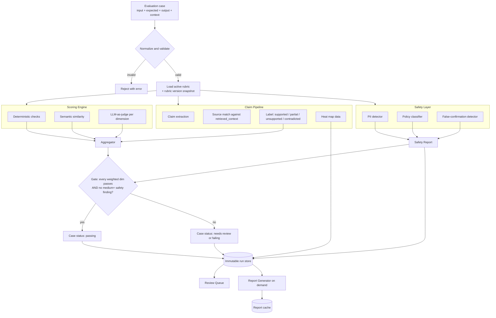

# Diagram — Evaluation Pipeline

End-to-end flow of one evaluation case, from input to stored report.

---

## What the diagram says

A case enters once and fans out to three parallel pipelines: scoring, claim work, and safety. They are independent; failure of one does not block the others. Their outputs converge in the aggregator and the gate, where the case's pass/fail status is determined.

Storage is downstream of every parallel pipeline. The run is written immutably once. The review queue and the report generator both read from the store; nothing writes back into the run. Human overrides (not shown here for clarity) live in a separate override store and feed the report at render time.

## What the diagram implies

- Safety is **not** a node inside scoring; it is a parallel layer with a hard gate. Lowering safety's "weight" does nothing; the gate is binary.
- The claim pipeline runs once and serves both hallucination and groundedness dimensions. They cannot disagree about claims — they share extraction.
- Reports are generated *from* storage, not *during* scoring. A report is a re-derivable view; the run is the source of truth.
- An invalid case is rejected at the front door. The system never silently coerces missing data into a score.

## Where teams misread this flow

A common mental model collapses the three parallel pipelines into "score it". When that happens, safety becomes "one of the dimensions" and gets weighted down. The diagram exists in part to prevent that collapse.

Another misread: treating the aggregator as the final word. It is not. The gate combines aggregated dimensions with safety findings. A high overall with an open safety finding is not "passing"; it is "needs review".
