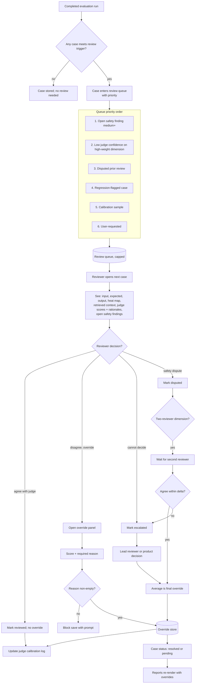

# Diagram — Human Review Flow

How a case enters the review queue, gets reviewed, and exits with overrides recorded.

---

## What the diagram says

A case enters the queue only when at least one review trigger fires. Triggers are ordered by priority, not by time. The reviewer sees full context — judge work plus evidence — not a blank evaluation form. The reviewer's decision branches into four states: agree, override, escalate, dispute. Overrides require a reason; the tool blocks empty reasons. Two-reviewer dimensions add a second-reviewer wait gate before the override is final.

Every override and every "agreed" review feeds the judge calibration log. Calibration data is the long-term value of the review queue, not just the per-case correction.

## What the diagram implies

- The queue is not chronological. Safety wins. A team that handles the queue in arrival order is doing it wrong.
- A reviewer cannot save an override without a reason. The reason is not optional UX polish; it is the calibration signal.
- "Cannot decide" is a valid state. The case routes onward; the reviewer is not blocked.
- Two-reviewer disagreements do not silently average past a threshold. They escalate.

## Where teams short-circuit this flow (and should not)

- **"Just override; we trust the reviewer."** Skipping the reason field destroys the calibration loop. Every reason has long-term value.
- **"The judge is good; we will only review safety."** Then judge drift is never measured. The 5% calibration sampling exists to prevent this.
- **"FIFO queue is fine for our scale."** Safety findings age out before they are seen.
- **"We do not need two-reviewer; we are a small team."** True until it is not. Configure two-reviewer where the cost of a missed finding is high.

## What a reader should leave with

Human review is a workflow with explicit states, not a vague "someone checks this". The queue order is a product opinion. The reason field is the calibration mechanism. Disputes have a defined path.
