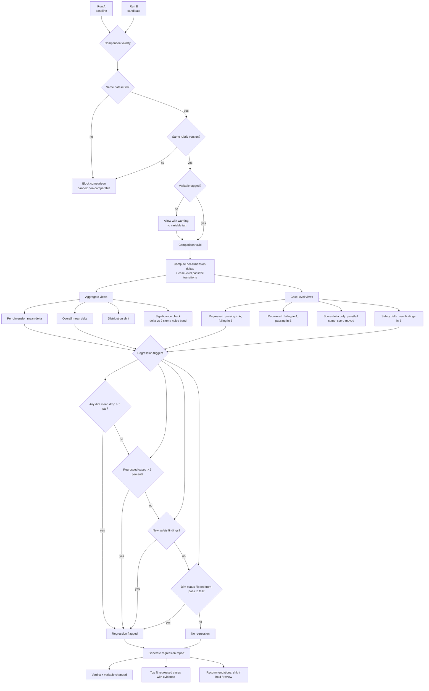

# Diagram — Regression Evaluation Flow

How two runs are compared, the validity checks that gate comparison, and the regression verdict.

---

## What the diagram says

A comparison cannot proceed without same-dataset and same-rubric. Both gates are hard. A missing variable tag is allowed but warns the reader that the run does not document what changed.

When the comparison is valid, the tool computes both aggregate deltas (per-dimension and overall) and case-level transitions (regressed, recovered, score-delta-only, safety-delta). The regression verdict comes from four independent triggers; any one firing flags the run as a regression.

The output is a regression report, not a tool verdict. The verdict is advisory: ship, hold, or review. The decision is human.

## What the diagram implies

- "Compare anyway" is not a feature. Mismatched datasets or rubrics block the comparison, with the reason on screen.
- Overall delta alone never triggers regression. The per-dimension and case-level checks always run too.
- A regression is **also** flagged when a dimension flips from passing-on-average to failing-on-average — even if the magnitude of the drop is below 5 points. Status changes matter.
- Safety findings are an independent regression trigger. A run with new safety findings is a regression even if every score went up.
- The 2σ noise check is shown but not used as a sole gate. It is an honesty annotation on small deltas; a 1-point overall delta that is well within noise gets labeled as such.

## What this diagram exists to prevent

- Shipping on a small mean improvement that is within LLM-judge noise.
- Shipping when one dimension regressed but the overall went up.
- Shipping when a new safety finding appeared but the aggregate did not move.
- Comparing apples to oranges and calling it a comparison.

## What a reader should leave with

Regression evaluation is a structured contract, not a feel. Four triggers, each independent, any one is enough. The dataset and rubric are locked. The verdict is a recommendation, not a decree.
