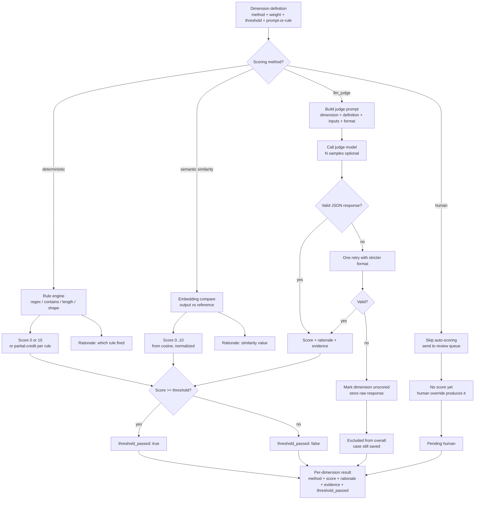

# Diagram — Scoring Flow

Per-dimension scoring decision tree, from rubric dimension to final dimension score.

---

## What the diagram says

Every dimension passes through one of four methods, and only one. The method is set in the rubric and cannot be ambiguous at run time. Each method produces a score and a rationale. The threshold check produces a pass/fail flag. The final per-dimension result is the tuple `(method, score, rationale, evidence, threshold_passed)`.

LLM-judge handles its own failure cases explicitly. A malformed judge response is retried once with stricter formatting; on second failure, the dimension is marked `unscored` and the raw response is saved for debugging. The case as a whole is still saved — never lost.

## What the diagram implies

- A dimension cannot be scored two ways. Mixing methods within a dimension is a category error the tool rejects.
- An `unscored` dimension is excluded from the overall aggregate; the report shows it as `n/a` with the reason. It is never silently coerced to `0`.
- A `human` dimension produces no auto-score. The case enters the review queue with `pending_human` status on that dimension.
- The rationale is part of the contract. A dimension result with no rationale is incomplete and is treated as `unscored`.

## Why this shape

The temptation when designing scoring is to make it "smart" — pick the best method per case, fall back automatically, blend scores. This shape rejects that.

- **Explicit method per dimension** makes the rubric debugable. "Why did this case score 6 on relevance?" has a deterministic answer.
- **Explicit failure handling** prevents the most common LLM-judge bug: a malformed response becomes a 0, which then drags down the overall.
- **Separate `pending_human`** prevents the second most common bug: counting "the human has not seen it" as a passing score.

## What a reader should leave with

Three takeaways:

- Scoring is a contract per dimension, not a global formula.
- LLM-judge failure is a first-class state, not an exception.
- A score and a rationale are inseparable in this design.
